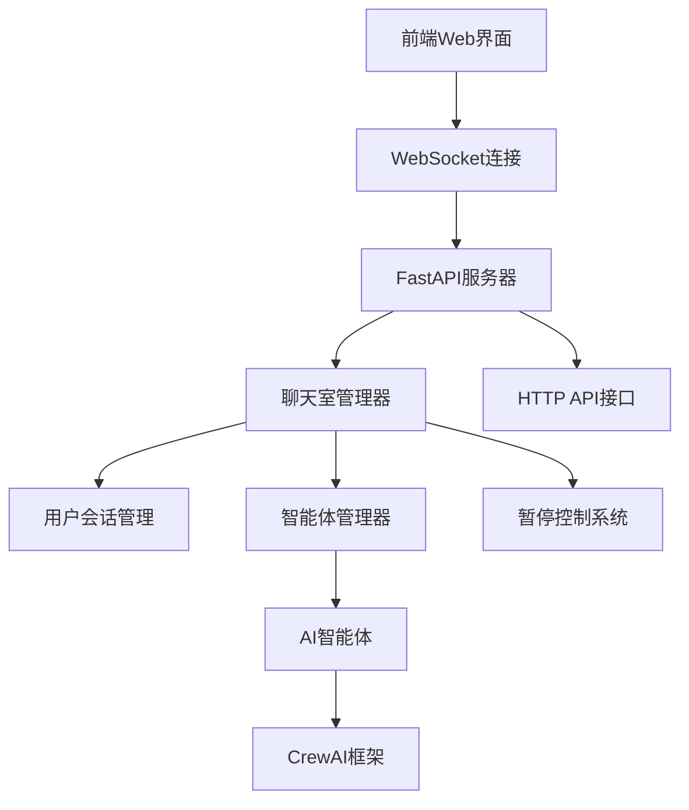

# WebSocket多人聊天系统使用指南

## 🎯 系统概述

这是一个基于WebSocket的实时多人聊天系统，专为"苏丹的游戏"设计。系统支持：

- **🎭 角色扮演**: 用户可选择扮演随从、妓女、老鸨或旁观者
- **🤖 人机混合**: 人类玩家与AI智能体共同参与对话
- **⏸️ 智能暂停**: 检测用户输入意图，自动暂停/恢复AI对话
- **🏠 多房间**: 支持多个聊天房间同时运行
- **📊 实时状态**: 场景数值、卡牌状态实时更新

## 🚀 快速开始

### 1. 安装依赖

```bash
pip install -r requirements.txt
```

### 2. 启动服务器

```bash
python start_websocket_server.py
```

服务器将在 `http://localhost:8000` 启动

### 3. 使用方式

#### 方式一: Web界面（推荐）
在浏览器中打开 `chat_client.html`

#### 方式二: API调用
参考 `demo_websocket_chat.py`

#### 方式三: 自定义客户端
使用WebSocket连接 `ws://localhost:8000/ws/{room_id}`

## 🎮 功能详解

### 角色系统

| 角色 | 描述 | 特权 |
|------|------|------|
| 人类随从 👤 | 玩家扮演随从执行任务 | 可暂停AI，参与对话 |
| 人类妓女 💃 | 玩家扮演妓女角色 | 可暂停AI，参与对话 |
| 人类老鸨 👑 | 玩家扮演老鸨管理者 | 可暂停AI，参与对话 |
| 旁观者 👁️ | 观看对话不参与 | 仅观看，无暂停权限 |

### 智能暂停机制

这是系统的核心功能，实现了真正的人机协作：

#### 🔄 工作原理

1. **输入检测**: 前端检测到用户在输入框输入时
2. **发送暂停**: 自动发送 `pause_request` 到服务器
3. **AI等待**: 服务器暂停AI智能体的自动回复
4. **持续监控**: 
   - 如果用户继续输入 → 持续暂停
   - 如果用户停止输入 → 10秒后自动恢复
5. **消息发送**: 用户发送消息后立即恢复AI对话

#### 📱 前端交互逻辑

```javascript
// 检测用户输入
messageInput.addEventListener('input', function() {
    const hasText = this.value.trim().length > 0;
    
    if (hasText && !isTyping) {
        // 开始输入 - 暂停AI
        sendPauseRequest();
        isTyping = true;
    } else if (!hasText && isTyping) {
        // 停止输入 - 恢复AI
        sendResumeRequest();
        isTyping = false;
    }
    
    // 重置10秒超时定时器
    resetPauseTimer();
});
```

#### ⚙️ 后端暂停控制

```python
# 暂停请求处理
async def handle_pause_request(self, user: ChatUser, data: Dict):
    room = self.rooms[user.room_id]
    duration = data.get("duration", 10)  # 默认10秒
    
    # 添加暂停请求
    room.pause_requests.add(user.user_id)
    user.pause_until = time.time() + duration
    
    # 暂停房间AI对话
    room.is_paused = True
```

### 消息类型

#### 客户端发送
- `join`: 加入房间
- `chat_message`: 发送聊天消息
- `pause_request`: 请求暂停AI
- `resume_request`: 请求恢复AI
- `typing_start/stop`: 输入状态

#### 服务器推送
- `join_success`: 加入成功
- `chat_message`: 用户消息
- `agent_message`: AI智能体消息
- `system_message`: 系统消息
- `room_state`: 房间状态更新

## 🏗️ 架构设计

### 系统架构图



### 核心组件

#### 1. WebSocketChatServer
- 主服务器类
- 处理WebSocket连接
- 管理聊天室和用户

#### 2. ChatRoom
- 房间状态管理
- 智能体协调
- 暂停控制

#### 3. ChatUser  
- 用户会话管理
- 角色权限控制
- 暂停状态追踪

#### 4. AgentManager
- 智能体生命周期管理
- 场景配置
- 对话调度

## 🔧 API参考

### WebSocket消息格式

#### 加入房间
```json
{
    "type": "join",
    "username": "张三",
    "role": "human_follower",
    "scene_name": "brothel"
}
```

#### 发送消息
```json
{
    "type": "chat_message", 
    "content": "大家好！"
}
```

#### 暂停请求
```json
{
    "type": "pause_request",
    "duration": 10
}
```

### HTTP API端点

#### 获取房间列表
```http
GET /rooms
```

#### 设置房间卡牌
```http
POST /rooms/{room_id}/card
Content-Type: application/json

{
    "title": "寻找秘密",
    "description": "在妓院中寻找苏丹的秘密文件",
    "card_type": "征服",
    "rank": "白银"
}
```

## 🎯 使用场景

### 场景1: 单人练习
- 用户选择"人类随从"角色
- 与AI妓女、老鸨、旁白互动
- 练习卡牌任务执行

### 场景2: 多人协作
- 多个玩家分别扮演不同角色
- 实时协作完成复杂任务
- AI智能体提供环境反馈

### 场景3: 混合模式
- 部分角色由人类扮演
- 部分角色由AI智能体控制
- 动态调整参与度

## 🔍 故障排除

### 常见问题

#### Q1: WebSocket连接失败
```bash
# 检查服务器是否启动
curl http://localhost:8000/

# 检查端口是否被占用
lsof -i :8000
```

#### Q2: AI智能体不回复
- 检查智能体是否正确加载
- 确认房间没有被暂停
- 查看服务器日志

#### Q3: 暂停功能异常
- 检查用户角色权限
- 确认前端发送暂停请求
- 查看后台任务是否正常运行

### 调试技巧

#### 启用详细日志
```python
import logging
logging.basicConfig(level=logging.DEBUG)
```

#### 监控WebSocket连接
```javascript
ws.onopen = () => console.log('已连接');
ws.onclose = () => console.log('已断开');
ws.onerror = (error) => console.error('错误:', error);
```

## 🚀 扩展开发

### 添加新角色类型

1. 在 `UserRole` 枚举中添加新角色
2. 更新前端选择器
3. 实现对应的AI智能体
4. 配置权限和功能

### 自定义智能体

1. 继承 `BaseGameAgent`
2. 实现必要的方法
3. 注册到 `AgentRegistry`
4. 配置场景使用

### 扩展消息类型

1. 在 `MessageType` 枚举中添加
2. 实现服务端处理逻辑
3. 更新前端消息处理
4. 添加相应的API

## 📈 性能优化

### 服务器优化
- 使用连接池管理WebSocket
- 实现消息队列处理
- 添加负载均衡支持

### 前端优化
- 实现消息分页加载
- 添加离线消息缓存
- 优化渲染性能

### 智能体优化
- 缓存智能体响应
- 实现批量处理
- 优化模型调用频率

## 🤝 贡献指南

欢迎提交Issue和Pull Request！

### 开发流程
1. Fork仓库
2. 创建功能分支
3. 提交更改
4. 创建Pull Request

### 代码规范
- 遵循PEP 8
- 添加类型注解
- 编写单元测试
- 更新文档

---

🎮 **享受苏丹的游戏！** 如有问题请查看FAQ或提交Issue。 